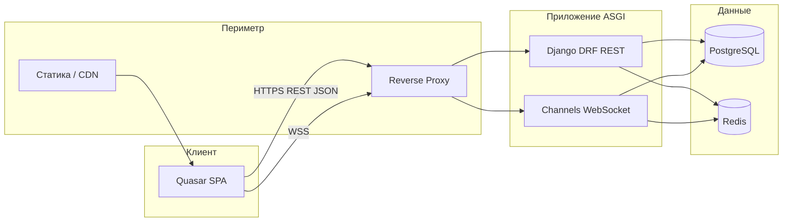
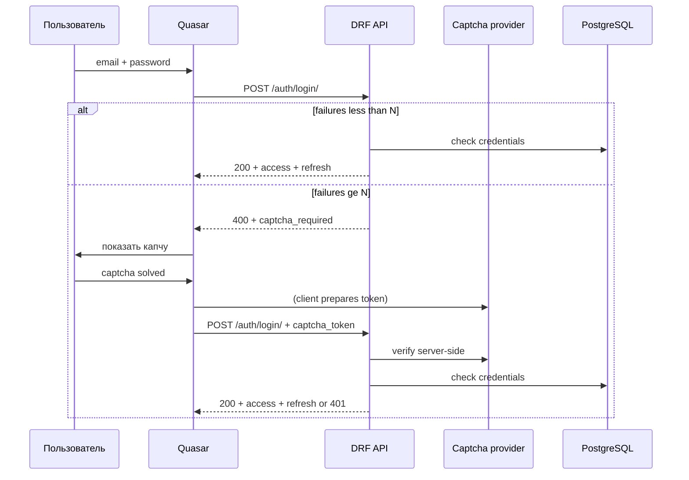

# Архитектура Network — от общего к частному

## 1. Назначение системы

**Network** — **универсальная** платформа: **социальный контур** (стена, ЛС, **сообщества** для всех пользователей) и **рабочий контур** (рабочие группы, канбан, главная `/work`) только для **`employee`** и **`admin`**, с разделением **штат (`internal`) / партнёр (`partner`)** для заказчиков и интеграторов. Регистрация, JWT, WS, hCaptcha. Подробно: [ROLES-AND-TASKS.md](./ROLES-AND-TASKS.md).

## 2. Высокоуровневая схема



- **Клиент:** **access** JWT в памяти (предпочтительно) или sessionStorage; **refresh** — httpOnly **cookie** (лучше с точки зрения XSS) либо secure storage — зафиксировать при реализации; не класть секреты в репозиторий.  
- **Reverse proxy** — TLS, gzip, лимиты тела, upgrade для **WebSocket**.  
- **Процесс приложения:** **ASGI** (Daphne/Uvicorn) одновременно обслуживает HTTP и WS.  
- **Redis** — **обязателен** для production-режима Channels (channel layer); плюс кэш/throttling по желанию.

Зафиксированные выборы: [DECISIONS.md](./DECISIONS.md).

### 2a. Redis и «сессии» WebSocket при перезапуске сервера

**Важно уточнить термины:**

1. **TCP/WebSocket — это живое соединение** между браузером и процессом ASGI. При **остановке или перезапуске** контейнера/процесса `daphne` все активные сокеты **обрываются**. Это нормальное поведение; **Redis не продлевает и не «замораживает»** эти соединения.

2. **Зачем тогда Redis для WebSocket:** в Django **Channels** бэкенд **channel layer** (Redis) — это **общая шина** между несколькими воркерами: `group_send`, маршрутизация сообщений между процессами и короткоживущие очереди. Без него несколько инстансов API не смогут доставлять события в одну комнату согласованно.

3. **Что «сохраняется» при рестарте:**  
   - **История ЛС и данные** — в **PostgreSQL** (и при необходимости кэш в Redis с TTL — не замена БД).  
   - **Вход пользователя в приложение** — в **JWT** (refresh/access), а не в «сессии WebSocket».  
   - После рестарта сервера клиент делает **`WebSocket` reconnect** (с backoff), снова проходит аутентификацию на WS, заново подписывается на группы; пропущенные сообщения при необходимости догружаются через **REST** (`GET .../messages/`).

4. **Дополнительно Redis не помешает** для `CACHES`, rate limit counters, опционально **`SESSION_ENGINE`** (если понадобятся серверные сессии Django, например для админки) — это **отдельно** от жизненного цикла WS-сокета.

Итого: Redis **нужен** для нормальной работы Channels в compose/prod; **не стоит** ожидать, что он сохранит «сессию WebSocket» при ребуте процесса — для этого предусмотрен **reconnect на клиенте** + **данные в Postgres** + **JWT** для auth.

## 3. Монорепозиторий (целевая структура)

```
network/
  docs/                     # эта документация
  backend/                  # Django-проект
    manage.py
    config/                 # settings, urls, asgi routing (HTTP + WS)
    apps/
      accounts/             # пользователь, auth, captcha-threshold
      profiles/             # профиль, аватар, настройки отображения
      walls/                # посты на стене, вложения-метаданные
      communities/          # сообщества (соц), доступ: user+
      messaging/            # диалоги, сообщения, consumers.py (WS)
      tasks/                  # WorkGroup, Board, Column, Task (доступ: employee+)
      directory/              # Company, Department; опционально Tenant
      common/                 # пагинация, permissions, mixins, RBAC-хелперы
  frontend/                 # Quasar CLI / Vite
    src/
      layouts/
      pages/
      composables/
      stores/
      boot/
      css/
      i18n/
  docker/                   # опционально: nginx.conf, entrypoints
  database/                 # см. DATABASE.md — только volume path + .gitignore
  docker-compose.yml
  docker-compose.override.yml.example
  .github/workflows/        # CI
```

## 4. Слои бэкенда (логическая архитектура)

| Слой | Роль | Типичные «классы» / модули |
|------|------|----------------------------|
| **Transport (HTTP)** | URL → View | `urls.py`, DRF `APIView` / `ViewSet`, routers |
| **Serialization** | Вход/выход JSON, валидация полей | `serializers.py` (`ModelSerializer`, custom `validate_*`) |
| **Authorization** | Кто может что | `permissions.py`, DRF `IsAuthenticated`, object-level permissions |
| **Domain / Application** | Правила бизнеса, сценарии | `services/*.py` (функции или маленькие классы), не раздувать View |
| **Persistence** | Таблицы, связи | `models.py`, менеджеры, `QuerySet` |
| **Integrations** | Капча, почта, файлы | `integrations/captcha.py`, email backends, S3-совместимое хранилище |

Принцип: **тонкие вьюхи**, **толстые сервисы** для сценариев (создание диалога, публикация на стену, смена пароля с проверкой токена).

## 5. Слои фронтенда

| Слой | Роль |
|------|------|
| **Router** | Маршруты, guards (auth, guest-only) |
| **Layouts** | Main (шапка/меню), Auth (минимальный chrome), Empty |
| **Pages** | Signup, Signin, Reset password, Profile+Wall, Settings, Messages, NotFound |
| **Composables** | `useAuth`, `useApi`, `useCaptcha`, `useTheme`, `useI18n` обёртки |
| **Stores (Pinia)** | сессия пользователя, UI-тема, счётчики непрочитанного |
| **API-клиент** | axios с interceptors: **Bearer access**, 401 → **refresh** → повтор запроса; composable **WebSocket** для ЛС |

## 6. Датафлоу (основные сценарии)

### 6.1 Регистрация и вход

1. Клиент: форма + клиентская валидация (Quasar rules / zod / vee-validate — выбрать один стиль).  
2. После **N неудачных попыток** (например, 3) бэкенд возвращает код `captcha_required`; клиент показывает **hCaptcha** (см. [DECISIONS.md](./DECISIONS.md)) и отправляет `captcha_token` с логином.  
3. Бэкенд: rate limit + **серверная** проверка токена у провайдера капчи.  
4. Успех: пара **JWT** (**access** + **refresh**) через **djangorestframework-simplejwt** (кастомный view логина при необходимости — капча до выдачи токенов).



### 6.2 Восстановление пароля

1. `POST /auth/password/reset/request/` — email; всегда **одинаковый** ответ с точки зрения перечисления пользователя (не раскрывать, существует ли email).  
2. Письмо со ссылкой с **подписанным uid + token** (Django `default_token_generator`).  
3. `POST /auth/password/reset/confirm/` — uid, token, new password.

### 6.3 Профиль и стена

1. `GET /users/{id}/` или `/profiles/{slug}/` — публичные данные + настройки видимости.  
2. `GET /walls/{user_id}/posts/` — пагинация постов; `POST` — авторизованный владелец или друг с правом (политика — в сервисе).  
3. Медиа: загрузка `POST /media/` → файл в object storage или локально в dev; в БД — URL + метаданные.

### 6.4 Личные сообщения

1. **REST:** список диалогов `GET /messaging/conversations/`; история `GET /messaging/conversations/{id}/messages/?cursor=`; первичная отправка может идти через `POST .../messages/` (запись в БД + публикация в группу WS).  
2. **WebSocket:** подключение к комнате пользователя и/или к диалогу; события: `message.created`, `message.read`, (опционально) typing.  
3. Клиент после загрузки истории подписывается на WS и мержит входящие события в store; при открытии чата догружает пагинацией через REST.

См. [DATAFLOW.md](./DATAFLOW.md) и [BACKEND.md](./BACKEND.md).

### 6.5 Перехват 404

- **Фронт:** catch-all route → страница «Страница не найдена» с ссылкой домой.  
- **Бэкенд:** для SPA в проде обычно отдают `index.html` на не-API пути; для `/api/*` — стандартный JSON 404 от DRF.

## 7. Доменные границы (Django apps)

- **accounts** — `User`, **роль** (`user` | `employee` | `admin`), для сотрудника — **`EmploymentKind`** (`internal` \| `partner`), опционально **Tenant**; JWT, капча.  
- **profiles** — био, аватар, приватность; **компания, отдел, должность**; **`dashboard_layout`**, опция **стартовой страницы** после логина — см. [ROLES-AND-TASKS.md](./ROLES-AND-TASKS.md) §2 и §5.  
- **walls** — `Post`, личная стена.  
- **communities** — **сообщества** (посты, участники), доступ **не** привязан к `employee`.  
- **messaging** — ЛС, **consumers**, routing.  
- **tasks** — **`WorkGroup`**, **`Board`**, **`Column`** (`semantic` из единого перечня), **`Task`**; только **employee+** и участники группы. См. [ROLES-AND-TASKS.md](./ROLES-AND-TASKS.md).  
- **directory** (опционально отдельно от profiles) — `Company`, `Department`.  
- **common** — пагинация, permissions (`IsEmployee`, `IsAdmin`, **`IsInternalStaff`** для `/internal/`), единый формат ошибок.

## 8. Безопасность и злоупотребления

- HTTPS везде вне localhost.  
- CORS: только origin фронта.  
- CSRF: для cookie-сессий — да; для **JWT в заголовке** на REST — обычно отдельная политика; если refresh в **httpOnly cookie**, продумать CSRF для refresh-эндпоинта (SameSite=Strict/Lax, отдельный путь).  
- Пароли: валидаторы Django, хэш по умолчанию (Argon2 при желании — настройка).  
- Лимиты: per-IP и per-account на `/auth/login/`, `/auth/password/reset/request/`.

## 9. Связь с остальными документами

- Детализация API и классов: [BACKEND.md](./BACKEND.md).  
- Quasar, лейауты, темы, i18n: [FRONTEND.md](./FRONTEND.md).  
- Postgres и папка `database/`: [DATABASE.md](./DATABASE.md).  
- Docker и env: [DOCKER-DEPLOYMENT.md](./DOCKER-DEPLOYMENT.md).  
- CI/CD: [CI-CD.md](./CI-CD.md).  
- Этапы работ: [PROJECT-PIPELINE.md](./PROJECT-PIPELINE.md).  
- Тестирование (бек + фронт): [TESTING.md](./TESTING.md).  
- Роли, канбан, админка: [ROLES-AND-TASKS.md](./ROLES-AND-TASKS.md).  
- Мониторинг и поддержка: [MONITORING-AND-SUPPORT.md](./MONITORING-AND-SUPPORT.md).  
- Свой почтовый сервер (экстра): [SELF-HOSTED-MAIL.md](./SELF-HOSTED-MAIL.md).
