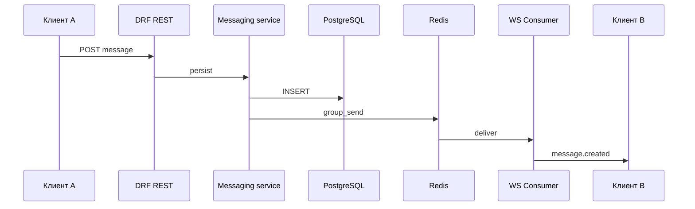

# Датафлоу Network (детализация)

Дополняет [ARCHITECTURE.md](./ARCHITECTURE.md). Здесь — потоки данных по сущностям и границам систем.

## Сущности и хранение

| Сущность | Где живёт | Кто пишет | Кто читает |
|----------|-----------|-----------|------------|
| User | `accounts_user` (+ возможное расширение) | регистрация, admin | auth, профиль, ACL |
| JWT refresh blacklist | таблица `token_blacklist` (SimpleJWT) | logout, ротация | проверка refresh |
| Profile | `profiles_profile` | настройки пользователя | страница профиля, поиск |
| Post | `walls_post` | автор поста | стена, лента (позже) |
| Conversation | `messaging_conversation` | первое сообщение / создание чата | список ЛС |
| Message | `messaging_message` | отправка (REST) | история диалога, WS-пуш |
| LoginAttempt / throttle key | таблица или Redis | неудачный login | решение о капче |
| WS события | Redis (channel layer) | сервис после `save()` | **Channels** → браузер |

## 1. Регистрация

```text
Client                    API                         DB
  |-- POST /auth/register/ ->|
  |                         |-- validate (serializer)
  |                         |-- create User (hash password)
  |                         |-- create Profile (signal или явно)
  |                         |-- issue JWT pair (SimpleJWT)
  |<-- 201 + access + refresh (или только access, refresh в cookie) |
```

Дополнительно: опциональная email-верификация (фаза 2) — отдельный токен и маршрут `confirm-email/`.

## 2. Логин с эскалацией капчи

```text
Client                          API                    Store (DB/Redis)
  |-- POST /auth/login/ ------->|                      |
  |                             |-- check throttle     |
  |                             |-- load fail count -->|
  |                             |-- if fails>=3 and no captcha -> 400 captcha_required
  |-- POST + captcha_token ---->|                      |
  |                             |-- verify captcha (HTTP provider)
  |                             |-- authenticate       |
  |                             |-- reset fail count ->|
  |                             |-- issue JWT pair
  |<-- 200 + access + refresh --|                      |
```

При неверном пароле: инкремент счётчика, **без** различия «нет пользователя» / «плохой пароль» в тексте ответа (единый `detail`).

## 3. Сброс пароля

```text
Client                         API                    SMTP / Mailhog
  |-- POST reset/request/ ---->|
  |                            |-- при валидном формате email — задача отправки (**не** ЛС)
  |                            |-- SMTP ----------------> (в dev — контейнер **Mailhog**)
  |<-- 202/200 generic --------|

User по ссылке на фронт с query uid, token.

  |-- POST reset/confirm/ ---->|
  |                            |-- validate token (Django)
  |                            |-- set_password + invalidate sessions/tokens (политика)
  |<-- 200 --------------------|
```

## 4. Профиль (чтение / обновление)

```text
GET /profiles/{id}/
  API -> Profile + User public fields -> serializer с учётом privacy -> JSON

PATCH /profiles/me/
  API -> permission IsAuthenticated -> service update_profile() -> DB
```

Аватар: отдельный шаг `POST /media/` → URL в профиле.

## 5. Стена

```text
GET /walls/{user_id}/posts/?cursor=
  API -> queryset фильтр по wall_owner, order, cursor pagination

POST /walls/{user_id}/posts/
  API -> service: может ли текущий user писать на эту стену -> create Post
```

События для будущей ленты друзей: outbox / сигнал → очередь (не в MVP).

## 6. Личные сообщения (REST + WebSocket)

```text
GET /messaging/conversations/
  API -> диалоги, где текущий user в participants, annotate last_message_at

POST /messaging/conversations/
  body: { "peer_id": "..." }
  API -> service find_or_create_dm() -> conversation id

GET /messaging/conversations/{id}/messages/
  API -> проверка membership -> сообщения по cursor

POST .../messages/
  API -> проверка membership -> create Message -> channel_layer.group_send(...)
  WS -> клиенты в группе conversation_{id} получают JSON-событие message.created
```



Клиент **B** может не вызывать REST, пока не нужна подгрузка истории; для первой загрузки чата — всё равно `GET .../messages/`.

## 7. Ошибки и коды

- Клиент мапит HTTP-коды: 401 → редирект на вход; 403 → сообщение «нет доступа»; 429 → «слишком часто».  
- Поле `code` в JSON (договорённость команды) для `captcha_required`, `email_not_verified`, и т.д.

## 8. Граница фронт ↔ бэк

- Все мутации идемпотентны где возможно (client-generated id для сообщений).  
- Пагинация: курсор предпочтительнее для лент с вставками; offset допустим для админки.
